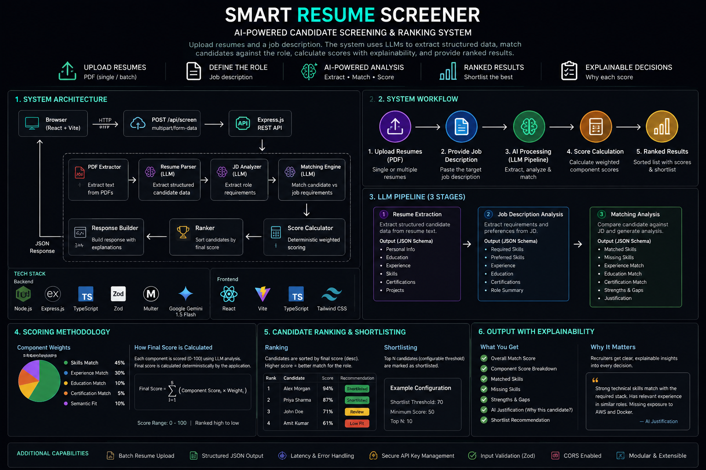

# Smart Resume Screener

An AI-powered resume screening tool that matches candidates to job descriptions with explainable, structured scoring.

## Why This Project?

- Structured AI extraction instead of raw text matching
- Semantic resume-to-job matching
- Deterministic weighted scoring
- Explainable candidate ranking
- Batch screening
- Recruiter-focused interface
- Modular backend architecture
- Validated LLM responses

## Overview

Smart Resume Screener automates the initial resume screening process for recruiters. It accepts one or more PDF resumes and a plain-text job description, then uses a Large Language Model (LLM) to extract structured data and perform semantic matching — producing ranked, scored, and shortlisted candidates with clear written justifications.

## Problem Statement

Manual resume screening is time-consuming, subjective, and inconsistent. Recruiters screening dozens of resumes per role often miss qualified candidates or apply inconsistent criteria. Smart Resume Screener solves this by:

- Extracting structured data from unstructured PDFs
- Analyzing the job description to identify what actually matters
- Applying consistent, weighted, deterministic scoring across all candidates
- Providing written explanations for every ranking decision

## Objectives

- Accept PDF resumes and a job description as input
- Extract candidate information (name, email, skills, education, experience, certifications)
- Analyze the job description for required and preferred criteria
- Use an LLM to semantically match candidates to the role
- Produce deterministic, weighted scores (not LLM-chosen numbers)
- Rank all candidates and identify shortlisted candidates
- Display results in a recruiter-focused dashboard
- Explain every score with textual evidence

## Features

- PDF resume upload (single and batch)
- Job description text input
- Structured resume data extraction (LLM)
- Job description analysis (LLM)
- Semantic resume-to-job matching (LLM)
- Deterministic weighted scoring
- Candidate ranking
- Shortlisting with configurable threshold
- Skill gap analysis
- Written justification per candidate
- Recruiter dashboard (React)
- Candidate detail view with score breakdown

## Screenshots

### Screening Dashboard


### Candidate Results


### Candidate Analysis


## Architecture



Browser
  ↓
React + Vite
  ↓
Express REST API
  ↓
PDF Extraction
  ↓
Resume Extraction (LLM)
  ↓
Job Description Analysis (LLM)
  ↓
Matching Analysis (LLM)
  ↓
Deterministic Score Calculator
  ↓
Candidate Ranker
  ↓
JSON Response
  ↓
Recruiter Dashboard

For more details, see [docs/architecture.md](docs/architecture.md).

## System Workflow

1. User uploads PDFs and enters a Job Description via the React frontend.
2. The Express backend receives the files and extracts raw text using `pdf-parse`.
3. The LLM extracts a structured JSON object from each resume.
4. The LLM analyzes the Job Description to extract hiring criteria.
5. The matching engine compares the candidate JSON to the job JSON to compute component scores.
6. A deterministic scoring formula computes the overall score.
7. The ranker sorts candidates and applies the shortlist threshold.
8. The frontend displays the ranked dashboard and detailed analysis.

## Tech Stack

### Backend
- Node.js
- Express
- TypeScript
- Zod
- multer
- pdf-parse
- Google Gemini API

### Frontend
- React
- Vite
- TypeScript
- Tailwind CSS

## Project Structure

```
RESUME_SCREENER/
│
├── frontend/             ← React + Vite application
├── backend/              ← Express + TypeScript API
├── docs/                 ← Technical documentation
├── .gitignore
├── .env.example
└── README.md
```

## AI / LLM Approach

**Provider:** Google Gemini 1.5 Flash (`gemini-flash-latest`)  
**Output format:** JSON (using `responseMimeType: "application/json"`)  
**Validation:** All LLM responses are validated against Zod schemas before use.  

### Stage 1 — Resume Extraction
PDF text → structured candidate JSON

### Stage 2 — Job Description Analysis
Job description → structured requirements JSON

### Stage 3 — Matching Analysis
Resume JSON + Job JSON → semantic matching analysis

The final overall score is calculated deterministically by the application rather than directly trusting an LLM-generated overall number.

For more details, see [docs/ai-and-prompts.md](docs/ai-and-prompts.md).

## Scoring Methodology

The overall score is calculated by the application using a fixed, deterministic weighted formula. The LLM provides only the individual component scores (0-100), which are then clamped and weighted.

- Skills Match: 45%
- Experience Match: 30%
- Education Match: 10%
- Certification Match: 5%
- Semantic Fit: 10%

**Formula:**
```
overallScore = 
    skillsScore * 0.45 +
    experienceScore * 0.30 +
    educationScore * 0.10 +
    certificationScore * 0.05 +
    semanticScore * 0.10
```

For more details, see [docs/scoring.md](docs/scoring.md).

## Candidate Ranking & Shortlisting

Candidates are sorted by their `overallScore` in descending order. Candidates with an `overallScore >= SHORTLIST_THRESHOLD` (default is 75) are marked as shortlisted. The threshold is configurable via the `SHORTLIST_THRESHOLD` environment variable.

## Explainable Candidate Screening

The system provides extensive explainability, including:
- overall match score
- component score breakdown
- matched skills
- missing skills
- strengths
- gaps
- experience analysis
- education analysis
- recommendation
- AI justification
- confidence where available

Recruiters can understand WHY a candidate was ranked highly rather than receiving only a black-box score.

## API Overview

| Method | Endpoint | Purpose | Input | Output |
|--------|----------|---------|-------|--------|
| `POST` | `/api/screen` | Screen resumes against a job description | `multipart/form-data` (files: `resumes`, text: `jobDescription`) | JSON with ranked candidates |
| `GET` | `/api/health` | Health check | None | JSON status message |

For more details, see [docs/api.md](docs/api.md).

## Installation & Running Locally

1. Clone the repository:
```bash
git clone https://github.com/DHANUSH-BHEEMSETTY/RESUME_SCREENER.git
cd RESUME_SCREENER
```

2. Start the backend:
```bash
cd backend
npm install
cp .env.example .env
# Edit .env and set GEMINI_API_KEY
npm run dev
```

3. Start the frontend (in a new terminal):
```bash
cd frontend
npm install
npm run dev
```

## Environment Variables

API keys and configurations are handled via `.env` files. 
- Backend secrets remain server-side.
- `.env` must never be committed.
- `.env.example` is provided as a template.

**Backend Variables:**
- `GEMINI_API_KEY` (Required): Your Google Gemini API key
- `PORT` (Optional): Backend port (default `3001`)
- `LLM_MODEL` (Optional): AI model string (default `gemini-flash-latest`)
- `SHORTLIST_THRESHOLD` (Optional): Minimum score for shortlisting (default `75`)
- `MAX_PDF_SIZE_MB` (Optional): Upload limit (default `10`)

## Testing

Run tests from the backend directory:
```bash
cd backend
npm test
```

For more details, see [docs/testing.md](docs/testing.md).

## Security

- environment-based API keys
- `.env` excluded from Git
- PDF validation
- structured LLM response validation
- controlled error responses
- no sensitive stack traces sent to frontend

For more details, see [docs/security.md](docs/security.md).

## Limitations

- scanned PDFs without embedded text require OCR
- LLM accuracy depends on input quality/provider availability

## Future Improvements

- OCR support
- recruiter authentication
- saved screening sessions
- CSV export
- advanced recruiter analytics

## Demo

To run a complete 2–3 minute demonstration of the Smart Resume Screener:

### 1. Define the role
Paste the target job description.

### 2. Upload candidates
Upload 3–5 sample resumes.

### 3. Run screening
Start the AI screening pipeline.

### 4. Review ranking
Show candidates sorted by overall score.

### 5. Open top candidate
Show score breakdown.

### 6. Explain the result
Show matched skills, missing skills, strengths, gaps, and AI justification.

### 7. Compare candidates
Open a lower-ranked candidate and explain the difference.

### 8. Close
Highlight:
- structured extraction
- semantic matching
- deterministic scoring
- explainable ranking
- automated shortlisting

## Assessment Demo Flow

1. Enter the target job description.
2. Upload 3–5 sample resume PDFs.
3. Run the screening pipeline.
4. Review ranked candidates.
5. Open the strongest candidate.
6. Review score breakdown.
7. Review matched and missing skills.
8. Review AI justification.
9. Compare with a lower-ranked candidate.

For more details, see [docs/demo.md](docs/demo.md).

## Development History

The project was developed in sequential phases, starting from a robust Express API foundation, moving to structured AI extraction with Gemini 1.5 Flash, implementing deterministic scoring, and finally wrapping it all in a recruiter-focused React dashboard. 

For a phase-by-phase breakdown, see [docs/development-log.md](docs/development-log.md).
