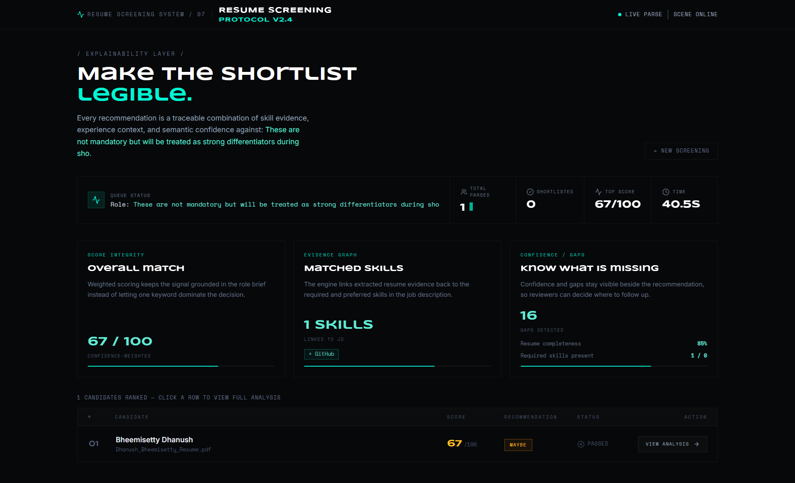
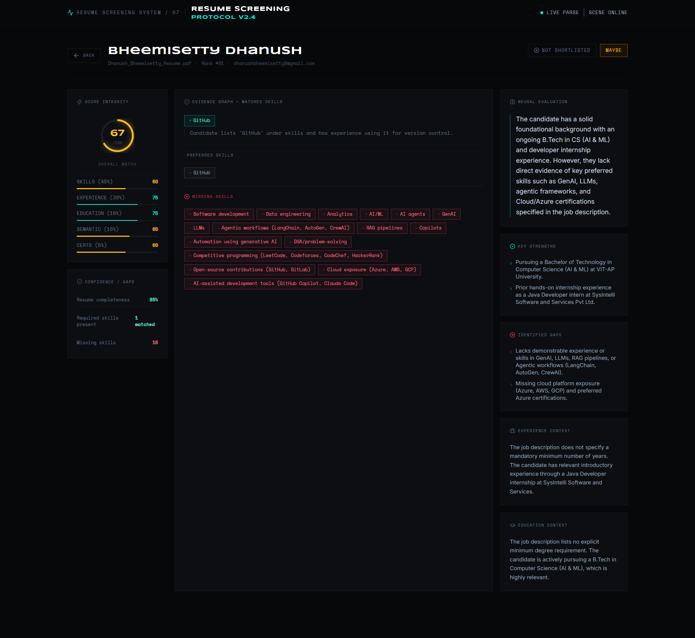
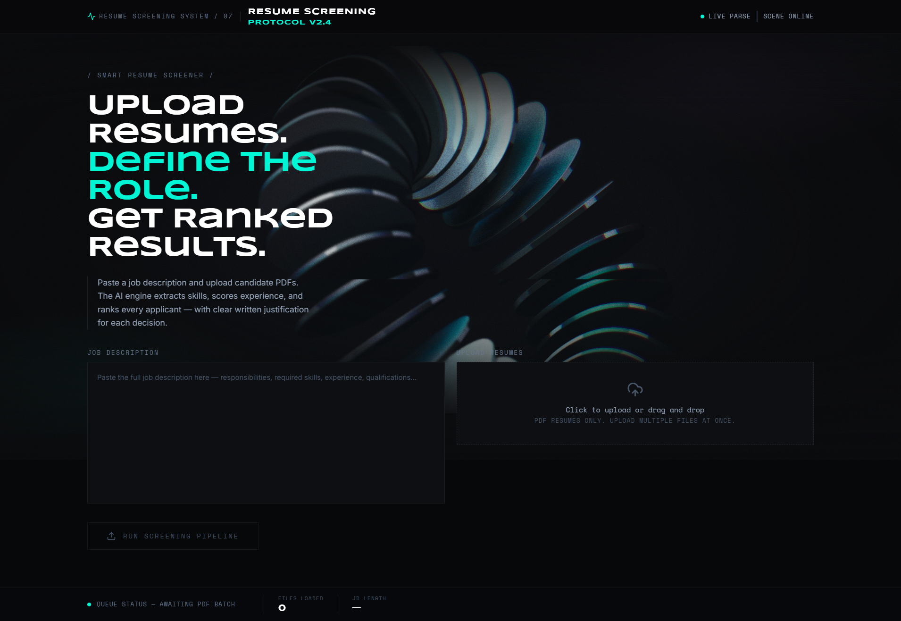

# Smart Resume Screener

> An AI-powered resume screening tool that matches candidates to job descriptions with explainable, structured scoring.

## Overview

Smart Resume Screener automates the initial resume screening process for recruiters. It accepts one or more PDF resumes and a plain-text job description, then uses a Large Language Model (LLM) to extract structured data and perform semantic matching — producing ranked, scored, and shortlisted candidates with clear written justifications.

The system is designed to be **explainable**, **reliable**, and **demo-ready**. Every score can be traced back to specific evidence from the resume.

## Problem Statement

Manual resume screening is time-consuming, subjective, and inconsistent. Recruiters screening dozens of resumes per role often miss qualified candidates or apply inconsistent criteria. Smart Resume Screener solves this by:

- Extracting structured data from unstructured PDFs
- Analyzing the job description to identify what actually matters
- Applying consistent, weighted, deterministic scoring across all candidates
- Providing written explanations for every ranking decision

## Objectives

- Accept PDF resumes and a job description as input
- Extract candidate information (name, email, skills, education, experience, certifications)
- Analyze the job description for required and preferred criteria
- Use an LLM to semantically match candidates to the role
- Produce deterministic, weighted scores (not LLM-chosen numbers)
- Rank all candidates and identify shortlisted candidates
- Display results in a recruiter-focused dashboard
- Explain every score with textual evidence

## Features

- PDF resume upload (single and batch)
- Job description text input
- Structured resume data extraction (LLM)
- Job description analysis (LLM)
- Semantic resume-to-job matching (LLM)
- Deterministic weighted scoring
- Candidate ranking
- Shortlisting with configurable threshold
- Skill gap analysis
- Written justification per candidate
- Recruiter dashboard (React)
- Candidate detail view with score breakdown

## Screenshots

**Screening Dashboard**


**Candidate Results**


**Candidate Analysis**


## Architecture

See [`docs/architecture.md`](docs/architecture.md) for full detail.

**High-level flow:**

```
Browser (React + Vite)
        │
        │  POST /api/screen  (multipart/form-data)
        ▼
Express REST API (Node.js + TypeScript)
        │
        ├─► PDF Extractor          → raw text per resume
        ├─► Resume Parser  (LLM)   → ParsedResume JSON
        ├─► JD Analyzer    (LLM)   → AnalyzedJob JSON
        ├─► Matching Engine (LLM)  → MatchResult JSON
        ├─► Score Calculator       → deterministic weighted scores
        ├─► Ranker                 → sorted + shortlisted candidates
        └─► Response               → ranked JSON → Frontend
```

## Tech Stack

### Backend
- Node.js
- Express
- TypeScript
- Zod
- multer
- pdf-parse
- Google Gemini (1.5 Flash)

### Frontend
- React
- Vite
- TypeScript
- Tailwind CSS

## Project Structure

```
RESUME_SCREENER/
│
├── frontend/             ← React + Vite application
├── backend/              ← Express + TypeScript API
├── docs/                 ← Technical documentation
├── .gitignore
├── .env.example
└── README.md
```

## AI / LLM Approach

**Provider:** Google Gemini 1.5 Flash  
**Output format:** JSON (using `responseMimeType: "application/json"`)  
**Validation:** All LLM responses validated against Zod schemas before use  

Three prompt stages:
1. **Resume Extraction** — extracts structured data from raw PDF text
2. **Job Description Analysis** — extracts structured criteria from JD text
3. **Matching Analysis** — evaluates candidate fit against job criteria and provides component scores with written justifications

## Scoring Methodology

The final score is calculated deterministically by the application using component scores from the LLM:

- Skills Match: 45%
- Experience Match: 30%
- Education Match: 10%
- Certification Match: 5%
- Semantic Fit: 10%

**Formula:**
`overallScore = round(skills × 0.45 + experience × 0.30 + education × 0.10 + certification × 0.05 + semanticFit × 0.10)`

## Candidate Ranking & Shortlisting

Candidates are sorted by `overallScore` descending. Candidates with `overallScore >= SHORTLIST_THRESHOLD` (default: 75) are marked as shortlisted. The threshold is configurable via environment variable.

## API Overview

| Method | Path | Description | Input | Output |
|---|---|---|---|---|
| `POST` | `/api/screen` | Screen resumes against a job description | `multipart/form-data` (files: resumes, text: jobDescription) | JSON with ranked candidates |
| `GET` | `/api/health` | Health check | None | JSON status message |

## Installation & Running Locally

```bash
# 1. Clone the repository
git clone https://github.com/DHANUSH-BHEEMSETTY/RESUME_SCREENER
cd RESUME_SCREENER

# 2. Backend setup
cd backend
npm install
cp .env.example .env
# Edit .env and set GEMINI_API_KEY to your Google Gemini API key
npm run dev

# 3. Frontend setup (new terminal)
cd frontend
npm install
npm run dev
```

## Environment Variables

API keys and configurations are handled via `.env` files. **Never commit `.env` to Git.** Use `.env.example` as a template.

**Backend Required Variables:**
- `GEMINI_API_KEY`: Google Gemini API key

## Testing

```bash
# Run tests (from backend directory)
cd backend
npm test
```

Tests validate core scoring logic, schema validation, API route handling, and matching engines.

## Security

- API keys are managed exclusively via environment variables and are never committed.
- Uploaded PDF files are processed in-memory and never persisted to the disk.
- LLM response structures are validated before any data is presented to the user.
- Controlled error responses ensure no sensitive stack traces are returned to the frontend.

## Limitations

- PDF files with scanned images (no embedded text) cannot be extracted without full OCR support.
- LLM accuracy depends on resume quality, formatting, and provider availability.

## Future Improvements

- Full OCR support for scanned documents.
- Recruiter authentication and saved screening sessions.
- Export results to CSV/Excel.

## Demo

To run a complete end-to-end demonstration of the Smart Resume Screener:

1. **Start the Backend:** In the `backend` directory, run `npm run dev`.
2. **Start the Frontend:** In the `frontend` directory, run `npm run dev`.
3. **Open the Application:** Navigate to `http://localhost:5173` in your browser.
4. **Enter a Target Job Description:** Paste a realistic software engineering job description into the text area.
5. **Upload Resumes:** Drag and drop 3–5 sample candidate PDF resumes into the dropzone.
6. **Run Screening:** Click the "Run Screening Pipeline" button and wait for the LLM extraction and scoring.
7. **Review Ranked Candidates:** Once complete, review the dashboard to see total candidates, shortlisted count, and the ranked table of results.
8. **Open a Candidate:** Click "View Analysis" on any candidate row.
9. **Review "Why this candidate?":** Observe the AI justification, matched skills, missing skills, and the explicit score breakdown.
